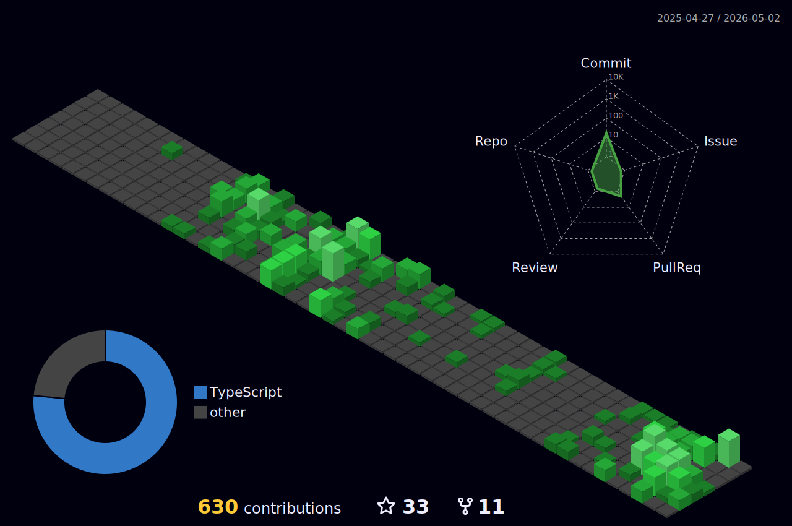

<h3 align="center">
	
Fancy seeing you here! 

Hi, I'm Daniel a Front-end Developer, Docker and Linux Enthusiast from Cape Town, South Africa. 
I am passionate about tech & and the open-source community. I am always open to collaborating on projects and innovative/disruptive ideas. 
Find out more about me & feel free to connect with me here!

</h3>

### ⚡ Technology Exposure 

# ⚡ Technology Exposure 

### CI

### Databases

### Frameworks, Platforms and Libraries

<!--  -->

### Hosting/SaaS

### Programming & Markdown, Styling Languages

### Testing

### Version Control

### Other

	

	

### 📈 Contributions
<h4 align="center">Isometric view of contributions in the last year. Languages pie is based on recent commits</h4>

	

