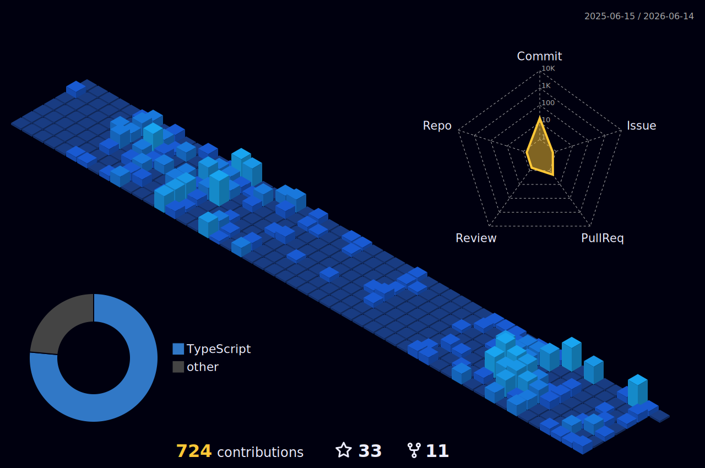

<h2 align="center">
Welcome 
</h2>

<h3 align="center">

</h3>

 

 

  

## About Me

I'm Daniel Leitch, a principal software engineer focused on building thoughtful products, strong frontend systems, and healthy engineering teams.

I learned this craft before AI, when building software meant sitting with a problem, understanding it properly, and shaping a solution from first principles. I love using AI, but to me it amplifies the craft rather than replacing it. The real work is still in the quality of the thinking, the care in the implementation, and the pride in building something well.

Most of my work sits between frontend engineering, product thinking, technical leadership, and developer experience. I care about shipping useful software, mentoring others, and helping create teams where collaboration and excellence can grow.

## What I've Been Working With Recently

- **Frontend:** Angular, Nx, React, Vite, TypeScript, JavaScript, Redux, GraphQL, Storybook, Cypress, Jest
- **App and package tooling:** Node.js, npm, reusable templates, small utilities, GitHub Actions, monorepo workflows
- **Backend and data:** Express, PostgreSQL, MongoDB, Firebase
- **Platform and delivery:** AWS, Docker, Vercel, Heroku, DigitalOcean, Google Cloud, Nginx, Cloudflare
- **Docs and systems work:** Markdown, technical documentation, workflow design, CI/CD
- **Hardware and tinkering:** ESPHome, ESP32, Arduino, Raspberry Pi, Ubuntu, self-hosted services

## Things You'll See Across My GitHub

- Frontend-heavy product engineering
- Angular and React ecosystem work
- React and TypeScript app work
- Examples and templates for faster project setup
- npm package experiments and small automation tools
- Documentation-heavy projects and internal platform thinking
- Docker and self-hosting projects
- IoT and home automation experiments

## A Few Representative Projects

- [`branchify`](https://github.com/danleitch/branchify): automation around Git workflows
- [`Doddle`](https://github.com/danleitch/Doddle): a recent product project worth keeping an eye on
- [`npm-package-template`](https://github.com/danleitch/npm-package-template): a starting point for publishing packages
- [`employee-management-system-frontend-react`](https://github.com/danleitch/employee-management-system-frontend-react): React-focused product UI work
- [`Search-Itunes`](https://github.com/danleitch/Search-Itunes): API-driven frontend experimentation
- [`Redux-Sagas-basic-example`](https://github.com/danleitch/Redux-Sagas-basic-example): state management patterns
- [`SVG-Converter`](https://github.com/danleitch/SVG-Converter): utility/tooling project
- [`esphome-ld2450`](https://github.com/danleitch/esphome-ld2450): hardware and home automation exploration

## Contributions

<h4 align="center">An isometric view depicting contributions made over the last year.</h4>

  

