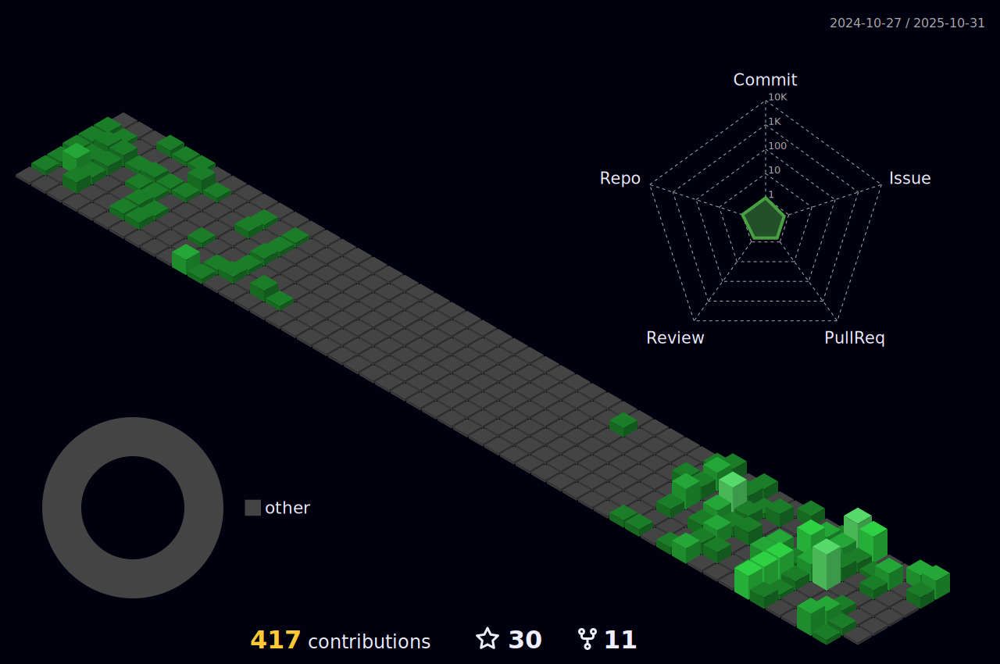

	
### Fancy seeing you here! 

<!--  -->

Hi, I'm Daniel a Front-end Developer, Docker and Linux Enthusiast from Cape Town, South Africa. 
I am passionate about tech & and the open-source community. I am always open to collaborating on projects and innovative/disruptive ideas. 
Find out more about me & feel free to connect with me here!

### ⚡ Technology Exposure 

	

	

### 📈 Contributions
<h4 align="center">Isometric view of contributions in the last year. Languages pie is based on recent commits</h4>

	

