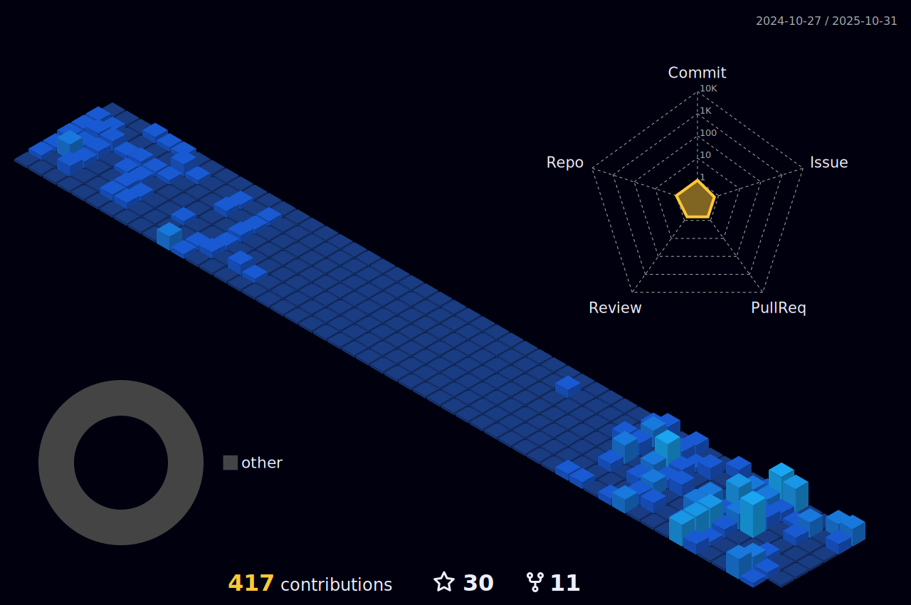

<h2 align="center">
Welcome  
</h2>

 
<h3 align="center">

Hey there! I am a passionate Frontend Developer with a strong technical background in React, Linux, and DevOps. I have a deep passion for all things tech and love contributing to the open-source community. If you have an innovative or disruptive idea, let's collaborate and make something great together. Want to know more about me? Don't hesitate to connect with me here!

</h3>

 

 

 

<!-- 

	

 -->

 

# 📈 Contributions
<h4 align="center">An isometric view depicting contributions made over the last year.</h4>

	

 

# ⚡ Technology Exposure

### CI/CD (Continuous Integration/Continuous Delivery)
- 
- 
- 

---

### Databases & Cloud Storage
- 
- 
- 

---

### Frameworks, Platforms, and Libraries
#### Web Development:
- 
- 
- 
- 
- 
- 
- 

#### Mobile App Development:
- 
- 

#### Static Site Generators:
- 
- 

#### Tools for Code Quality & Security:
- 
- 
- 
- 

---

### Hosting/SaaS Providers
- 
- 
- 
- 
- 
- 

---

### Programming & Styling Languages
- 
- 
- 
- 
- 
- 

---

### Testing & Code Quality
- 
- 
- 
- 

---

### Version Control
- 
- 
- 

---

### Orchestration & Virtualization
- 
- 
- 
- 
- 

---

### DNS & Web Servers
- 
- 
- 

---

### IoT & Other Tools
- 
- 
- 
- 
- 
- 
- 
- 
- 
